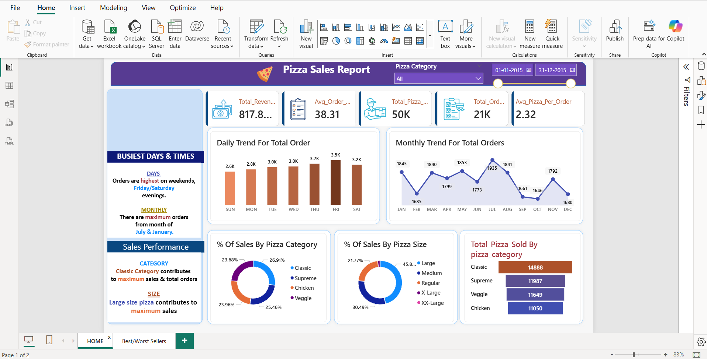
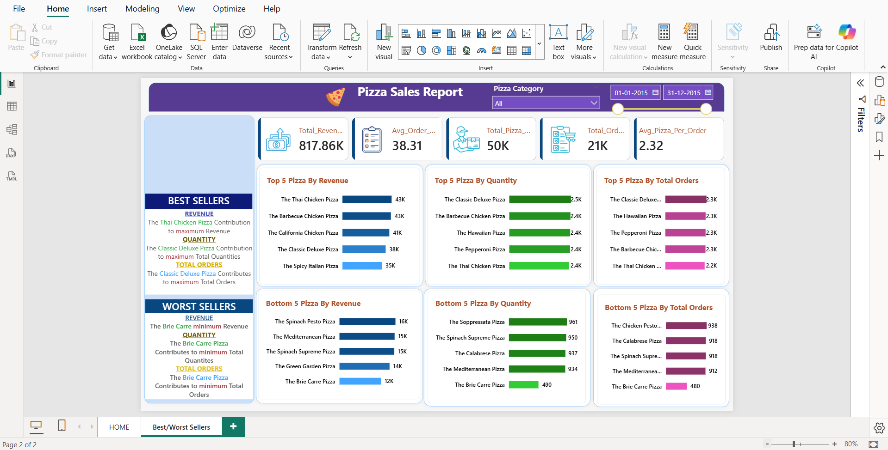

# 🍕 Pizza Sales Dashboard — SQL, Microsoft Excel & Power BI

An end-to-end pizza sales analytics solution using SQL for data extraction, Excel for data cleaning, and Power BI for interactive dashboard reporting.

---

## 🛠️ Tools Used
- **SQL** — Data extraction, KPI calculations, aggregations
- **Microsoft Excel** — Data cleaning and preparation
- **Microsoft Power BI** — Interactive dashboard and visualizations

---

## 📁 Project Structure
```
├── pizza_analysis_dashboard.pbix      # Main Power BI dashboard file
├── pizza_sales_excel_file.xlsx        # Cleaned dataset
├── Pizza_sales_queries.docx           # SQL queries used
├── Screenshot 2026-04-24 113201.png   # Dashboard preview 1
└── Screenshot 2026-04-24 113255.png   # Dashboard preview 2
```

---

## 📌 Key KPIs (calculated via SQL)
| Metric | Description |
|---|---|
| Total Revenue | Sum of all pizza order values |
| Average Order Value | Revenue divided by total orders |
| Total Pizzas Sold | Sum of pizza quantities sold |
| Total Orders | Count of unique orders |
| Average Pizzas per Order | Pizzas sold divided by total orders |

---

## 🔍 Features
- **SQL queries** to compute all KPIs using GROUP BY and aggregate functions
- **Daily & monthly order trends** to identify peak business periods
- **Sales by pizza category** — percentage breakdown across categories
- **Top 5 pizzas by revenue** — identifying best sellers
- **Bottom 5 pizzas by revenue** — identifying underperformers
- **Interactive Power BI dashboard** with slicers for category and date filtering

---

## 📷 Dashboard Preview




---

## 💡 Insights
- Peak orders occur on weekends, especially Friday and Saturday evenings
- Classic and Supreme categories drive the majority of revenue
- Top 5 pizzas alone account for a significant share of total sales
- Bottom performers highlight menu optimization opportunities

---

## 👩‍💻 About Me
**Madhura Shinde** — Data Analyst | MIS Executive  
📧 madhurashinde4523@gmail.com  
🔗 [LinkedIn](https://www.linkedin.com/in/madhura-shinde-579948367/)
